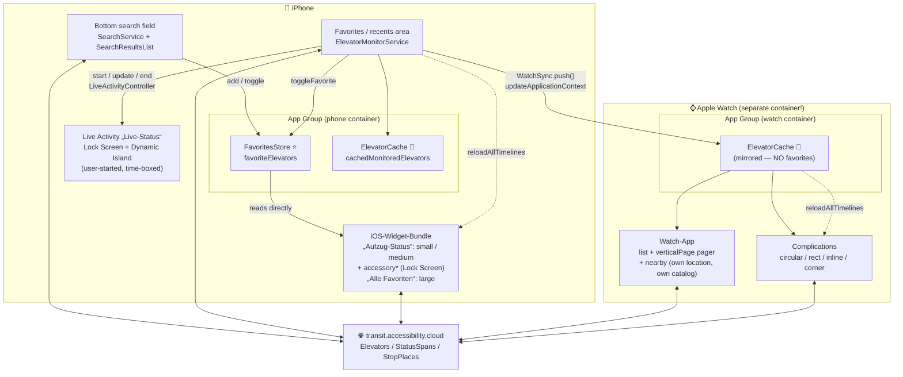

# Architecture

The *why* behind this design is in
[`business-requirements.md`](business-requirements.md).

Hissi monitors elevators via the
[transit.accessibility.cloud](https://transit.accessibility.cloud) API (a
Payload CMS: flat Elevators/StatusSpans/StopPlaces collections, joined
locally by id) across four targets. The **iOS app is the single source of truth**: favorites are
created and managed only there (iPhone, and the same app on iPad and Mac); the
widget, watch app and complications are read-only mirrors. The iOS app also
mirrors the favorites into the user's iCloud key-value store
(`FavoritesCloudSync`, merge rules in `FavoritesCloudMerge`), so they survive a
reinstall and reach the user's other devices — the App Group store stays what
every target reads.

## Data flow



The **`WatchSync.push()` edge is the only place data crosses devices.** It carries
a snapshot of the favorites list via WatchConnectivity `updateApplicationContext`
(latest state only, delivered opportunistically). The watch has **no favorites of
its own** — `WatchSync.decode()` mirrors the payload into the watch's own
`ElevatorCache` and reloads the complications, which is why the complications read
the cache rather than favorites.

## Where each UI gets its data

| UI            | Source                                   | Latency                          |
|---------------|------------------------------------------|----------------------------------|
| iOS app       | `FavoritesStore` (authoritative)         | live                             |
| iOS widget    | `FavoritesStore` directly (same container) | instant (`reloadAllTimelines`) |
| Watch app     | `received` from WatchConnectivity, else mirrored cache | once the sync lands  |
| Complications | mirrored `ElevatorCache` (not favorites) | after sync + `reloadAllTimelines` |

The **order** of that list is decided once, on write: `FavoritesStore` keeps the
favorites in the order the user sees (`FavoritesOrdering`, pure) — newest first
by default (`FavoritesOrder.recentlyAdded`, keyed on `MonitoredElevator.addedAt`)
or the order dragged into place in the iOS app (`.manual`). Every mirror renders
the array as it stands, so no other surface sorts.

Every UI fetches live status itself via `ElevatorRefresher` and falls back
to its respective cache on failure; a cache written within the last 90 s
(`RefreshInterval.cacheReuseSeconds`) answers a widget timeline reload
outright — several kinds reload together, and the app reloads them right
after its own refresh. Search and favorite management exist **only**
in the iOS app.

## Fetch & parse

`ElevatorRefresher.refreshAll()` refreshes all favorites in **one targeted
request** (`EquipmentCatalog.equipment(for:)` →
`AccessibilityCloudClient.fetchEquipment`: `where[id][in]` over the numeric
favorite ids, `depth=1` + `populate` resolve the current status span inline
— sub-second, no StatusSpans/StopPlaces fetch, no catalog build). A
still-fresh catalog cache answers for free. Non-numeric seed-record
favorites bridge to their live records via the operator inventory number as
soon as any cached catalog knows them (`EquipmentCatalog.bridgedLiveIds`) —
the favorite then adopts the live id (`StatusMerge`, persisted via
`FavoritesStore.migrateIds`) — and resolve from the bundled seed with
unknown status until then.
transit.accessibility.cloud is the **only** status source: the platform
ingests the operator feeds (incl. DB FaSta, ~every 2 min) itself, which is
what the former FaSta override and brokenlifts.org scraping compensated for.
On failure an elevator keeps its previous values and its id is reported
back. Favorites carry the API's numeric ids; favorites from before the
migration (old `_id`, `fasta-…`, `brokenlifts-…`) are deleted once with a
dismissible DE/EN notice (`FavoritesStore.removeLegacyFavoritesIfNeeded`,
iOS app only — it owns the favorites).

For the **search-only** catalog build, `AccessibilityCloudClient` fetches
the three flat collections paginated (`depth=0`, `select[]` on the needed
fields, `limit=1000`, pages 2…n in parallel — 6 requests total) and joins
them locally
(`join`, pure): the elevator's own `operational_status` decides, the current
StatusSpan adds disruption text and status-change date; unknown stays
unknown, never a false "working". Spans are fetched active-only — the full
collection is history.

Name search happens locally and two-phase: `SearchService` first renders
instantly from `EquipmentCatalog.snapshot()` — the in-memory or
**disk-persisted** catalog (App Group container, shared with the widget; live join + fetch time, seed
overlay applied on load so a newer bundled seed reworks old data) of any
age, which kicks off the shared rebuild when stale — then awaits the fresh
catalog and re-renders with live statuses; while that refresh is pending, a
subtle "Status wird aktualisiert …" banner tops the list so the shown
(possibly stale) statuses never look final. On the very first launch (no
snapshot yet) the bundled seed previews station names — fully favoritable:
a seed-id favorite resolves from the seed (status unknown) until a catalog
knows its live counterpart, then bridges to it via the operator inventory
number (`EquipmentCatalog.bridgedLiveIds`, pure) and adopts the live
numeric id (`StatusMerge`; the app persists the migration via
`FavoritesStore.migrateIds` on the next refresh). A cold build is pure server time
(~20–30 s fixed cost per list request); speculative pagination — the
remembered per-collection page count sends all expected pages alongside
page 1 — keeps it to one round instead of two. `EquipmentCatalog` (an actor with a 10-min TTL;
concurrent callers share one in-flight build) caches the joined catalog and
filters by station name. The live fetch is overlaid with the bundled seed
catalog (`Shared/Resources/seed-catalog.json`, regenerated per release by
`scripts/generate-seed-catalog.py`), matched via the operator inventory
number: the seed backfills what the API doesn't serve (source/operator
names, coordinates, region — not station names any more: every record it
matches is stop-place linked, and the ~2570 unlinked live records have no
station reference at all and stay invisible) and keeps gap stations
searchable with unknown status (currently
only S Fredersdorf) — plus the whole seed as offline fallback. What the
number leaves unanswered — ~30 seed numbers went stale upstream (e.g.
U Spittelmarkt), and most live records have no seed counterpart at all —
falls back to the **station** (`EquipmentCatalog.stationBackfilled`): the
seed records whose station name matches once the network prefix is folded
away (`stationKey`: "U Spittelmarkt (Berlin)" = the stop place's
"Spittelmarkt (Berlin)") supply coordinates and region, and source/operator
only when they all name the same one — a station served by two operators
keeps those rows empty rather than claiming the wrong one. Live always wins,
and the inventory number is never taken from a sibling: it identifies the
elevator, not the station. Without this fallback the detail view silently
drops its map, its Look Around view and both name rows.

Results are grouped by `SearchGrouping` (pure, unit-tested): **region →
station → network**. Region (Berlin/Brandenburg; headers only when both are
present) comes from the AGS prefix of the StopPlace's DHID, the seed's
`region` field (FaSta has no federal state — the generator classifies its
coordinates against the real state boundaries and drops stations outside
Berlin/Brandenburg; DB's "Berlin" name prefix overrides broken coordinates),
or a name heuristic. Stations merge
across sources by name; `TransitNetwork.classify` splits a station's
elevators into U-Bahn/S-Bahn/Regionalverkehr subsections — the BVG feed
carries U- and S-platform elevators at S+U stations, so the description
decides; unmarked street/mezzanine elevators form a "Zugang" bucket. The
stop place's transport modes (`Equipment.stationNetworks`) settle what
neither feed nor name carries: DB records at unprefixed S-Bahn stations
(Waßmannsdorf) and unmarked elevators at single-network stations; seed-only
records carry no modes, so offline the name fallbacks remain.

Beyond status, `MonitoredElevator` also carries `sourceName`, `organizationName`,
a `stateExplanation` and the station's `latitude`/`longitude` (from the seed —
the API serves no geometry). `stateExplanation`
comes from the active StatusSpan's description and is only carried through while
`isWorking == false` — a reason on a working elevator would be stale by
definition. All four are shown only in the iOS and watch **detail**
views; the coordinate additionally drives a tappable map snippet there
(`MKMapItem.openInMaps()`), the device position as a `UserAnnotation` once
the user has granted location access — asked for by a priming pill on the
map itself, never by the map on its own, and the frame widens to hold both
only while the device is within 2 km — and, where Apple has coverage, a **Look Around**
preview below it (`MKLookAroundSceneRequest` → `LookAroundPreview`, iOS 17+,
no API key and no third-party SDK) — tapping opens the full-screen viewer
inside the app. A nil scene means no coverage at that spot, and the preview
simply stays absent. On iPhone in landscape, the detail view renders fields
and map as two columns instead of stacked; with a scene the map column
splits between map and Look Around.

### Timestamps

Each `MonitoredElevator` carries two distinct times:

| Field         | Meaning                                                        |
|---------------|----------------------------------------------------------------|
| `lastChecked` | when the app last polled (`Date()` at fetch)                   |
| `lastUpdated` | the source's own `lastUpdate` — how fresh the status actually is |

A fresh poll can still return stale source data, so these are kept apart. All
favorites are polled together, so "checked" is global: shown once per list
(iOS favorites footer, watch list footer) as the max `lastChecked`.
Per-elevator surfaces (rows, iOS/watch detail) show `lastUpdated`
("Stand …") only. The complications show no time at all — aggregate status
only.

### The aggregate verdict

Every glanceable surface — iOS Lock Screen widgets, StandBy, the watch
complications and the watch Smart Stack — reduces the favorites to one verdict
before rendering. `Shared/ElevatorSummary.swift` is that reduction: pure,
platform-free (no WidgetKit, no SwiftUI) and unit-tested, so all four families
on both devices speak one vocabulary.

| verdict | when | short form | full sentence |
|---------|------|-----------|---------------|
| `noFavorites` | nothing favorited | `Keine Favoriten` | `Keine Favoriten` |
| `broken` | ≥1 broken | `n defekt` | `n außer Betrieb` |
| `unknown` | ≥1 unknown, none broken | `?` | `n unbekannt` |
| `allWorking` | all working | `OK` | `Alle in Betrieb` |
| `awaitingSync` | watch only: nothing mirrored yet | `?` | `Status unbekannt` |

`awaitingSync` never falls out of an elevator list — only the watch constructs
it, for the gap before the first favorites sync has ever landed: an empty
mirror means "membership unknown", and "Keine Favoriten" would be as false a
statement there as "Alle in Betrieb" is for an empty favorites list.

Precedence is broken → unknown → all-clear, and "no favorites" is its own case:
with nothing to monitor, "Alle in Betrieb" would be a false all-clear.
`affectedStations` lists the stations behind a non-clear verdict (broken first,
deduplicated) — the one extra line the rectangular families have room for.
`relevanceScore` (broken 100 / unknown 25 / else 0) is what ranks the widget in
the iOS widget stack and the watch Smart Stack: a broken elevator surfaces on
its own, an all-clear never crowds the stack.

### Lock Screen & complication layouts

The three states are green (all working), red (≥1 broken; count where space
allows) and gray (unknown) — but colour is never load-bearing: the Lock Screen
renders in vibrant mode and tinted watch faces flatten colour, so the symbol's
SHAPE and the words carry the status. No data-age display — freshness comes
from the refresh cadence. Strings shown in German (source language); English
via the string catalog.

```
circular: symbol on the accessory      rectangular: symbol + name, status,
background (watch adds a status ring)  affected station

    ╭ ─ ─ ─ ╮                          ┌──────────────────────┐
   ╱         ╲                         │ ! Hissi   (status colour)
  │  ✓ ! ? ☆  │                        │ 2 außer Betrieb
   ╲         ╱                         │ S+U Pankow
    ╰ ─ ─ ─ ╯                          └──────────────────────┘

inline: plain text, system-monochrome  corner (watch only): status word,
                                       curved "Hissi" as identity
Hissi: OK | 2 defekt | ?
                                         ╭─ Hissi ─
                                         │  OK | DEFEKT | ?   (status colour)
```

iOS supports circular, rectangular and inline on the Lock Screen; the watch
adds corner and reuses rectangular as its Smart Stack face. Condensation rule:
rectangular and inline carry the broken **count**, circular and corner only the
verdict. App identity: rectangular/inline show the name inline, corner in its
curved widget label; the circular's space is reserved for the status shape —
there VoiceOver announces "Hissi: …" instead. VoiceOver always gets the full
sentence, as one element per widget, never symbol/number/caption as separate
stops.

### Live Activity — the „Live-Status"

The one surface that is not passive. Every other glanceable surface waits to be
looked at; the live status is **started by the user** for a trip, sits on the
Lock Screen and in the Dynamic Island, and **alerts** when something changes. Without
a push server that alert (`AlertConfiguration`, no notification permission
needed) is the app's only way to reach someone whose phone is in a pocket.

Scope is all favorites — the same set, the same verdict as everywhere else
(`ElevatorSummary`, FR13) — plus the most urgent rows underneath
(`ElevatorRanking.byUrgency`, shared with the widget list, so a broken elevator
never falls off the cap).

| Piece | Where | What |
|---|---|---|
| Rules | `Shared/LiveStatus.swift` | mode, `ContentState`, alert transitions, end rule — pure Foundation, unit-tested |
| ActivityKit shell | `Shared/LiveStatusAttributes.swift` | `ActivityAttributes`, `#if os(iOS) && canImport(ActivityKit)` |
| Stop button | `Shared/LiveStatusIntents.swift` | `LiveActivityIntent`; in `Shared/` because the extension references it and the app runs it |
| Plumbing | `Hissi/Services/LiveActivityController.swift` | start / update / end, adoption after a cold start |
| UI | `HissiWidget/LiveStatusActivity.swift` | Lock Screen + Dynamic Island (compact, minimal, expanded) |
| Start & stop | `Hissi/Views/LiveStatusSection.swift` | above the favorites list — that is exactly its scope |

Two ways to end, chosen at start and fixed for the activity's lifetime (they are
part of the static attributes): **`trip(endsAt:)`** runs for two hours (the Lock
Screen shows a countdown that ticks without any update), **`untilRepaired`** —
offered only while something is actually broken — ends the moment no favorite is
broken any more. Either way the activity ends when the last favorite is removed:
an empty live status would sit there saying nothing. iOS also ends Live Activities
after a few hours on its own, which the start UI says out loud.

Updates ride the existing refresh path: every `ElevatorMonitorService.refresh()`
and every background run calls `LiveActivityController.refresh(with:)`. There is
no push server, so those are the only moments the live status learns anything —
and that is made visible rather than hidden: each update carries a `staleDate`
two live-status cycles out, and past it the activity says "Status möglicherweise veraltet"
(`context.isStale`) instead of presenting an old status as current (FR21b, same
honesty as FR9/D3).

Alerts compare **per elevator id** against the previous favorites, not by counts
— one elevator breaking while another is repaired leaves the counts identical
and still deserves an alert, while a standing disruption must never re-announce
itself on every refresh. Newly favorited elevators and a fall back to *unknown*
(a source failure, FR10) never alert.

Unlike the accessory families the activity renders in full colour and may use
the status palette; the status is still carried by the symbol's shape and by
words, and every unit is one VoiceOver element with a full sentence (Q2).

### App Shortcuts

`Hissi/Intents/` holds three presets (FR20) — app target only, since the Shortcuts
app, Spotlight and Siri read them from the app and `Shared/` would compile them into
all four targets. Both status intents funnel through `IntentRefresh.refreshedFavorites()`,
which refreshes every favorite (one targeted request answers them all) and hands the
result to `RefreshFanOut.distribute` — the one post-refresh fan-out (cache, widget
timelines, watch push, live-status update) every refresh path shares — before
reporting: a Shortcut run is a refresh like any other, so no surface shows older
data than Siri just spoke.

The parameterized shortcut is the one with a moving part: the system enumerates
`ElevatorEntityQuery.suggestedEntities()` into one phrase per favorite, so the set has
to be re-published (`updateAppShortcutParameters()`) whenever favorites change — which
is why that call sits next to `WidgetCenter.reloadAllTimelines()` in
`toggleFavorite`, and once more on launch.

Phrases live in their own catalog (`Hissi/AppShortcuts.xcstrings`, recognized by file
name) because every phrase carries `\(.applicationName)` and Xcode extracts exactly
those separately; everything else stays in `Shared/Localizable.xcstrings`.

All three intents adopt `PredictableIntent`. That covers the surfaces where the system
*proposes* an action instead of the user picking one — Siri Suggestions, Spotlight —
and `predictionConfiguration` is what makes the proposal readable ("S+U Pankow prüfen",
not "Aufzug prüfen"). It is worth being precise about what this does **not** do: it has
no effect on the widget gallery, whose ordering has no API (see below), and none on the
Smart Stack, which is driven by `TimelineEntryRelevance`.

A description predicts nothing on its own — the system needs to observe the action.
`ElevatorMonitorService.refreshRequestedByUser()` donates `CheckElevatorsIntent` and is
wired to exactly the two deliberate refreshes (pull-to-refresh, toolbar button). The
on-appear load, the 30-minute poll and the foreground refresh stay undonated: they run
whether or not anyone asked, so donating them would teach a pattern the user never
expressed. The `IntentDonationManager.donate(intent:)` call is awaited with `try?`,
so it fails quietly — a lost donation must never break a refresh.

### Widget gallery presence

The gallery's *ordering* — which app sits where in the picker — is system-controlled
and has no API; it follows usage and on-device intelligence. `TimelineEntryRelevance`
does not touch it either: on iOS it only drives Smart Rotate inside a Smart Stack
(Apple's own note is that the `relevance()` callback is ignored on iPhone/iPad
entirely and matters only on watchOS). Intent donations feed Spotlight, Lock Screen
shortcuts and Smart Stacks — again not the gallery.

What *is* controllable, and what this project therefore does:

| lever | how |
|-------|-----|
| how many tiles the app occupies | `WidgetBundle` with two widgets; declaration order = gallery order, hero first |
| what each tile is called | `configurationDisplayName` — never repeating "Hissi", since the gallery already groups tiles under the app name |
| what the tile previews | `getSnapshot` returns `previewElevators` when `context.isPreview`, so the gallery shows a populated widget with a real disruption instead of an empty "Keine Favoriten" tile |

The remaining escalation would be `AppIntentConfiguration` + `recommendations()`
(iOS 17+), which can put several *pre-configured* tiles of one widget kind in the
gallery — e.g. one per favorited station. That requires turning the widget into a
configurable one with a station parameter, which changes the product (today one
widget covers *all* favorites), so it is deliberately not done.

## Refreshing

The iOS app refreshes on launch, every `RefreshInterval.minutes` (30), on
foreground (`scenePhase → .active`), on pull-to-refresh, and via a toolbar
button. On `scenePhase → .background` it schedules a `BGAppRefreshTask`
(`BackgroundRefreshManager`): the handler re-fetches the favorites, updates
`ElevatorCache`, reloads the widget timelines and pushes to the watch, so the
mirrors stay fresh between foreground sessions.

While a **live status** (Live Activity) runs, both cadences tighten to
`RefreshInterval.liveStatusMinutes` (10): the foreground poll reads the running state
off `LiveActivityController`, the background scheduler off the App-Group flag
`LiveStatusFlag` (it runs outside the main actor, and a stale hint costs
nothing but one early request). Updating an activity from the background is
allowed — only *starting* one needs the foreground. The request budget stays
bounded either way: still one targeted request per refresh, and only for the
couple of hours a live status lives (Q4).

Status requests run on dedicated `URLSession`s that bypass the cache
(`reloadIgnoringLocalCacheData`), so a live poll never returns stale cached
data. The targeted favorites fetch times out at 20 s — fast enough for the
background-refresh budget, which sees no other request. Catalog list pages
(search-only, foreground) legitimately take ~20–25 s server-side and get
their own 45 s session.
